# Eventos Santiago - Proyecto de Programación Web Avanzada - Noviembre de 2021

## Hecho por

- Audric Rosario
- Zheng Peng Li

### Presentación

En este proyecto, se implementa una arquitectura de microservicios con el motivo de crecer de forma horizontal, para garantizar alta disponbilidad y rendimiento.

Para lograr esto, se utilizan los recursos de Spring Boot Cloud.

### Características

- Springboot v2.5 (Backend) (Aplicación)
  - Instancias (3 de cada uno):
    - Base Usuario
    - Base Compra
    - Base Notificaciones
- Spring Cloud Gateway (Enrutamiento dinámico)
- Spring Cloud Netflix Eureka Server (Balanceador de carga)
- Spring Boot Actuator (Monitoreo de instancias de la aplicación)
- Spring Cloud Config Server (Centralización de la configuración de la instancias)
- Base de datos MySQL Server
- Java Web Token (JWT)
- Java Mail API
- Docker
  - Configuración: Docker Compose

### Diseño del Proyecto

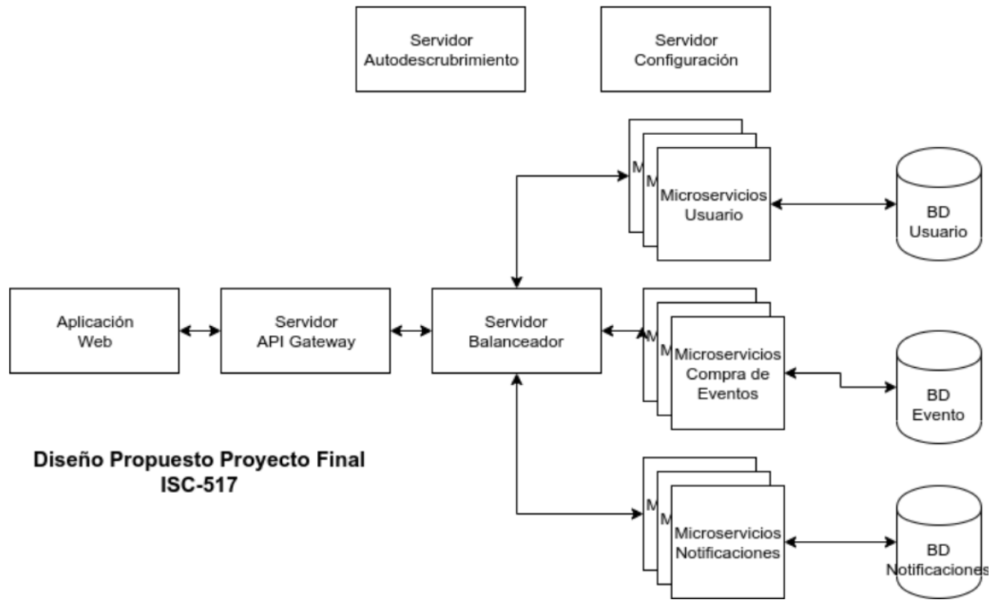

### Página Principal

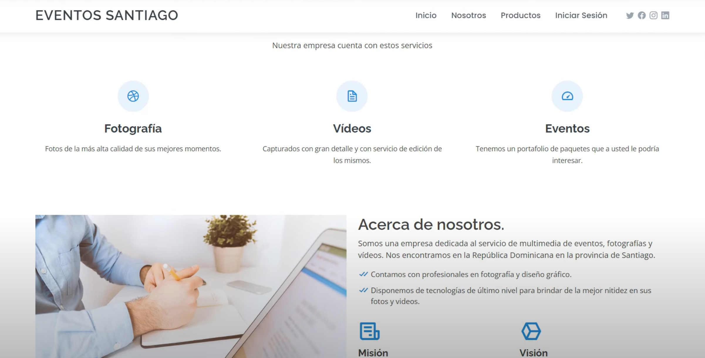

### Inicio de sesión

- Inicio

  

- Registro

  

- Correo de registro exitoso

  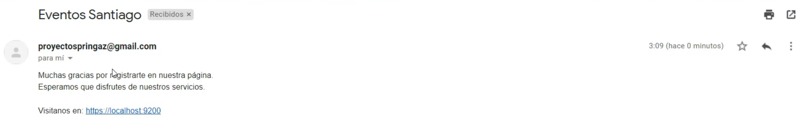

- Página principal después de iniciar sesión

  

### Vistas del cliente

- Tienda

  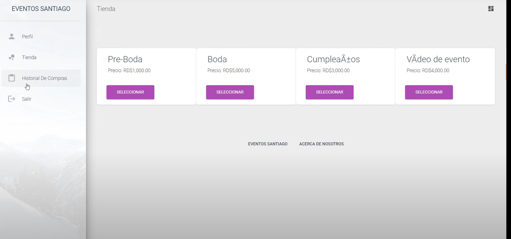

- Historial de compra

  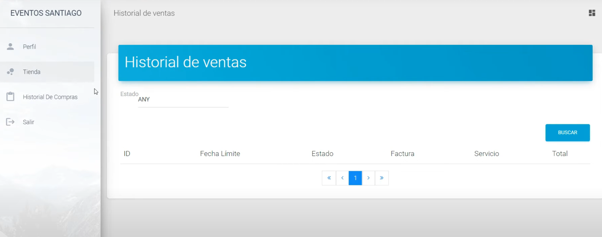

- Facturación

  

- Perfil de usuario

  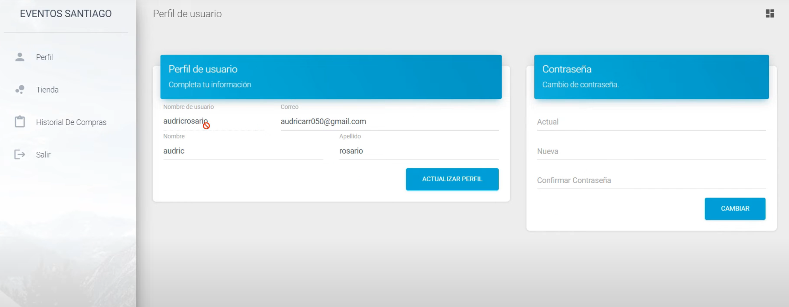

### Vistas del administrador

- Dashboard

  

- Control de usuarios

  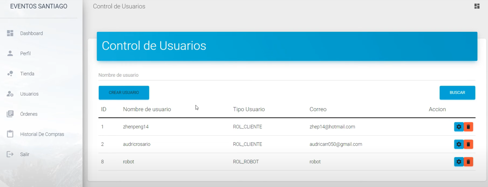

  Cambio de datos del usuario

  

  Cambio de autoridad de usuario

  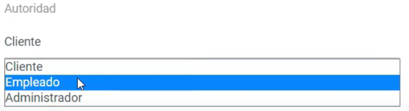

  

  Eliminar usuario

  

- Órdenes de compra

  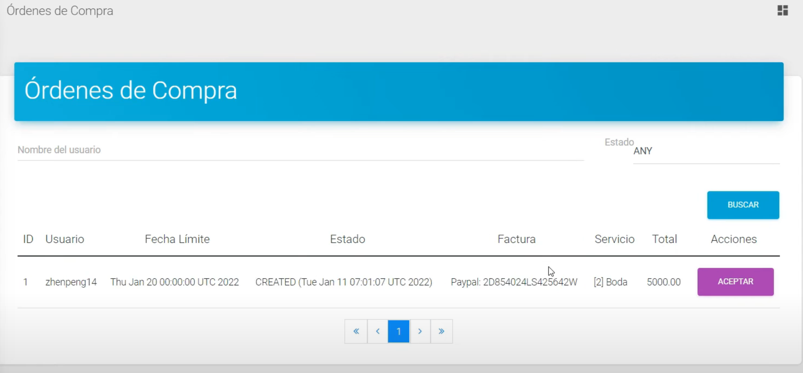

- Historial de ventas

  

### Preparación de microservicios

- Levantar servidores con docker compose, desde "api-gateway.yml"

  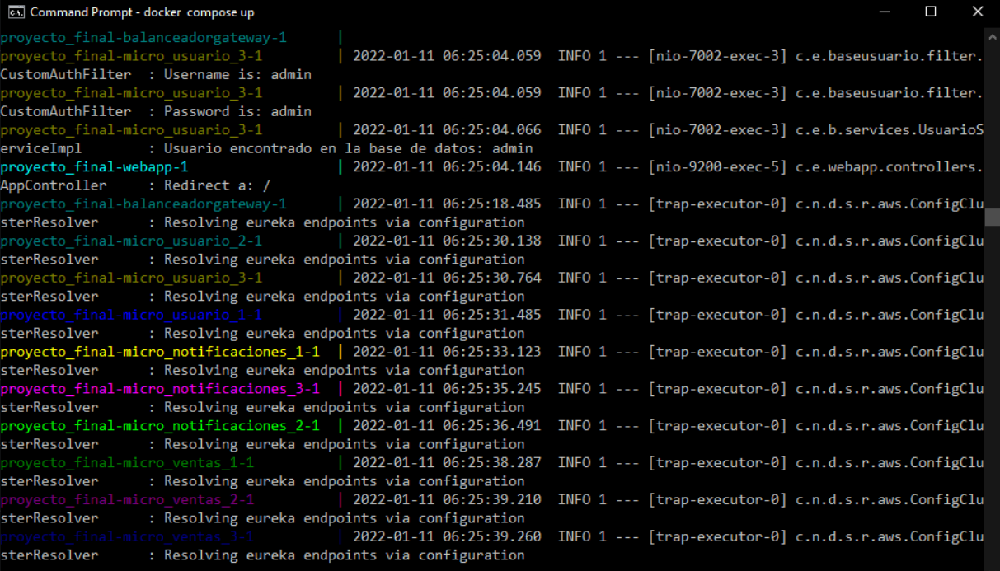

  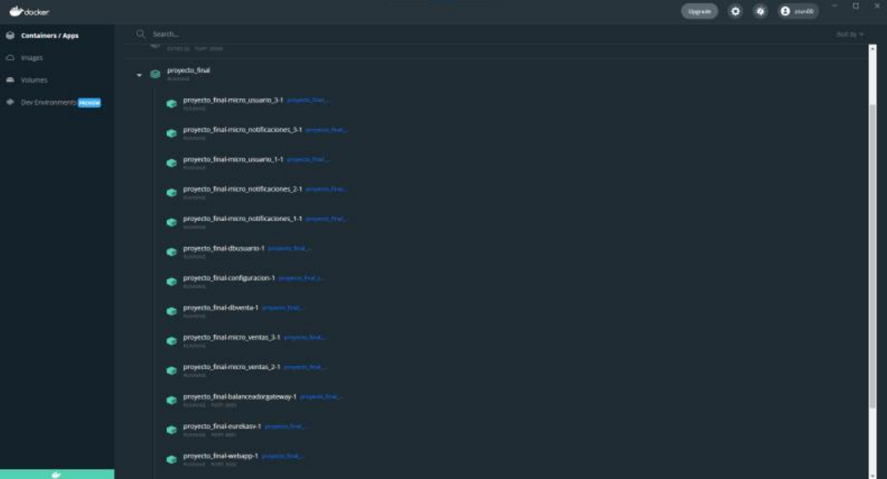
