# Photography Services Website - Advanced Web Programming Project - November 2021

## Made by

- Audric Rosario
- Zheng Peng Li

### This README is available in

- [English](README.md)
- [Spanish](README-ES.md)

### Presentation

In this project, a microservices architecture is implemented to scale horizontally and ensure high availability and performance.

To achieve this we used Spring Boot Cloud Services.

### Features

- Springboot v2.5 (Backend) (App)
  - Instances (3 ea):
    - User Base
    - Purchase Base
    - Notification Base
- Spring Cloud Gateway (Dynamic Routing)
- Spring Cloud Netflix Eureka Server (Load Balancer)
- Spring Boot Actuator (Application Instance Monitoring)
- Spring Cloud Config Server (Instance Configuration Centralization)
- MySQL Server Database
- Java Web Token (JWT)
- Java Mail API
- Docker
  - Configuration: Docker Compose

### Project Design

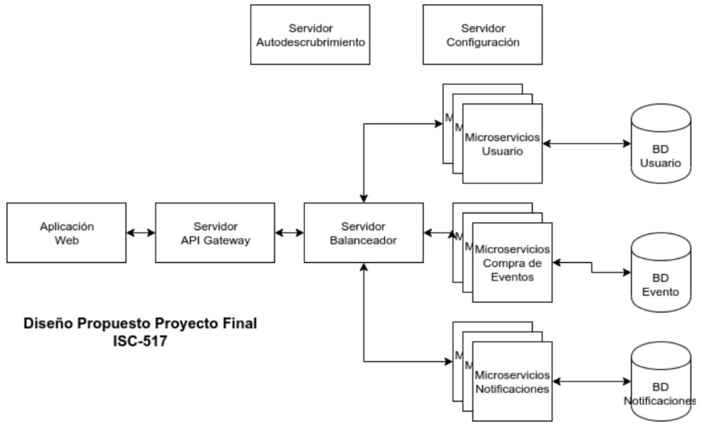

### Main page

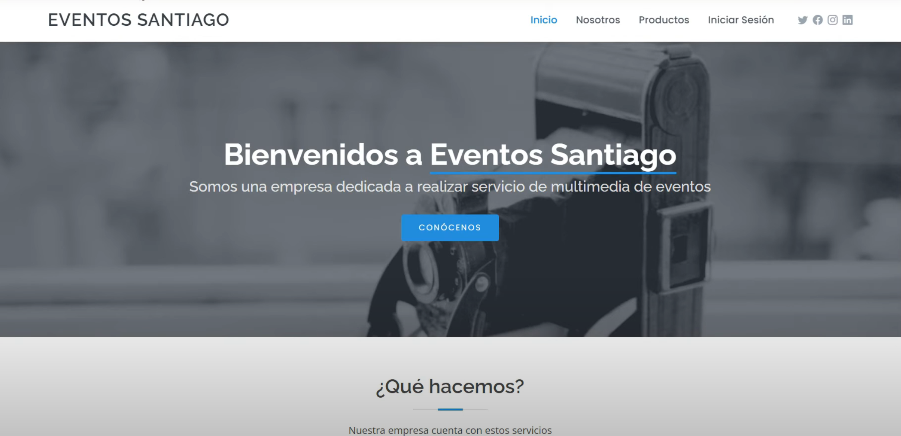

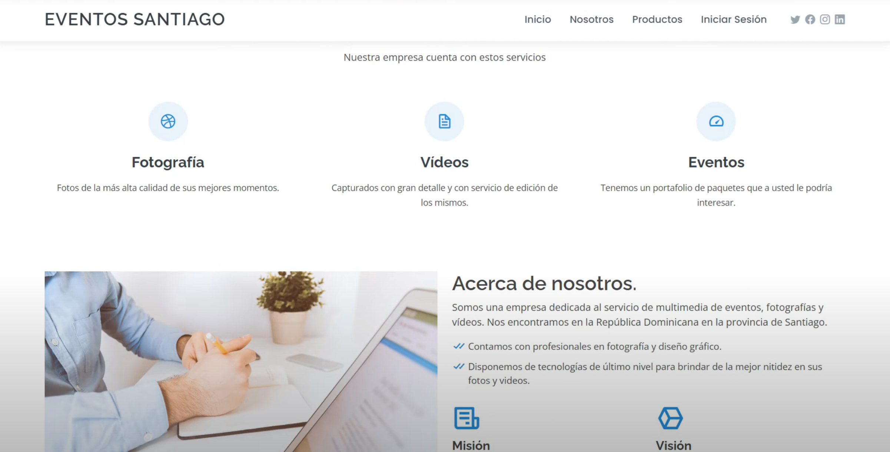

### Log in

- Log in

  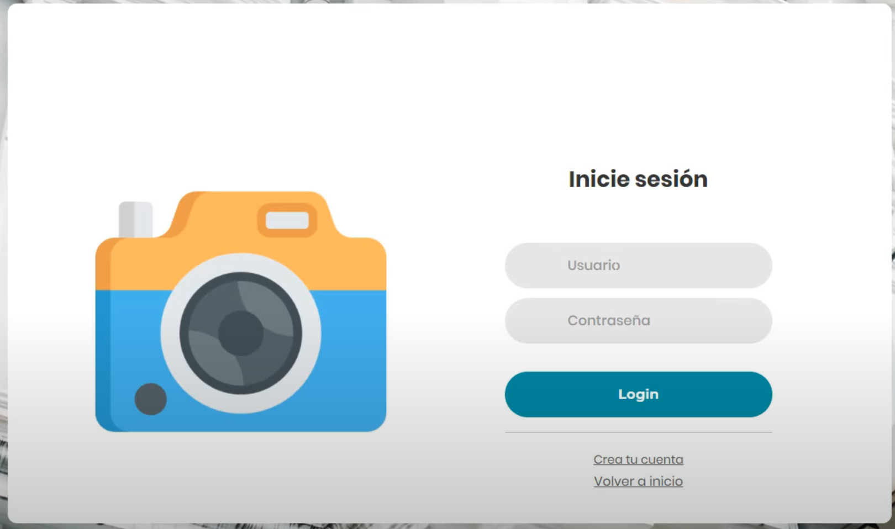

- Sign Up

  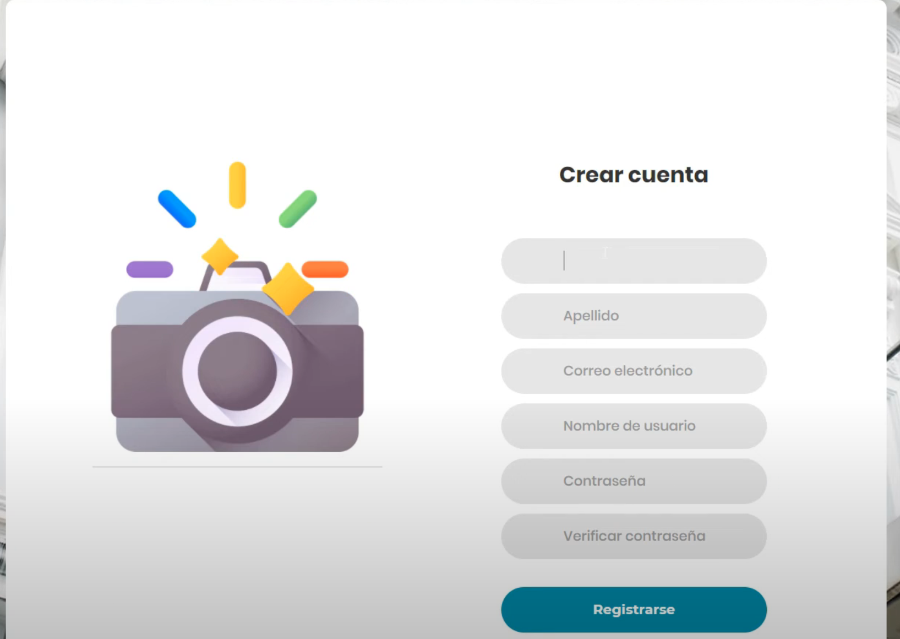

- Registration success email

  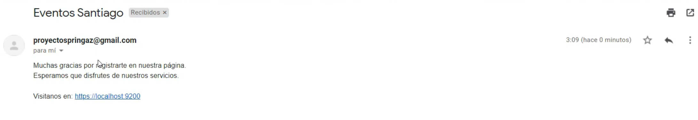

- Home page after login

  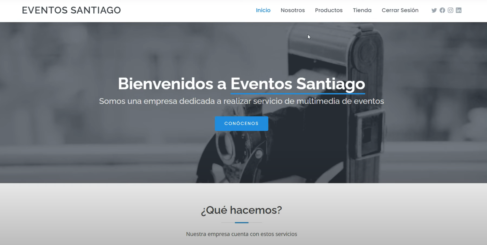

### Client Views

- Shop

  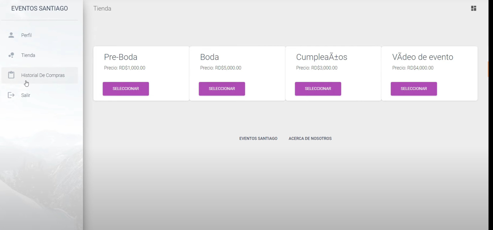

- Purchases History

  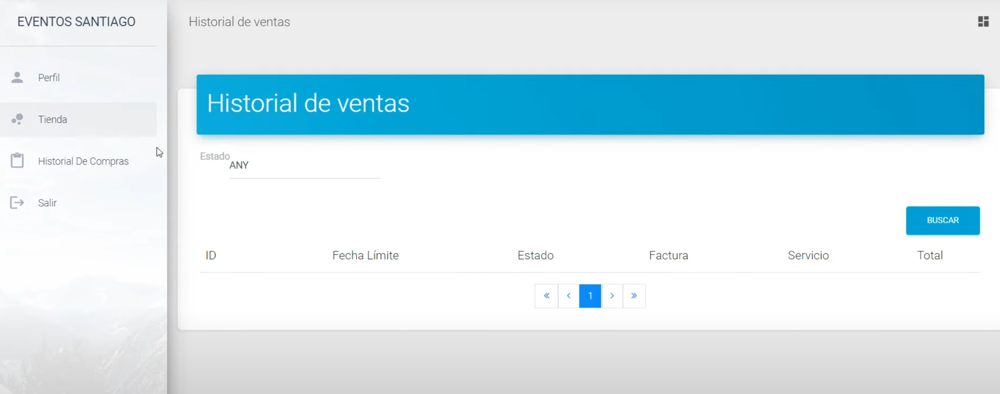

- Billing

  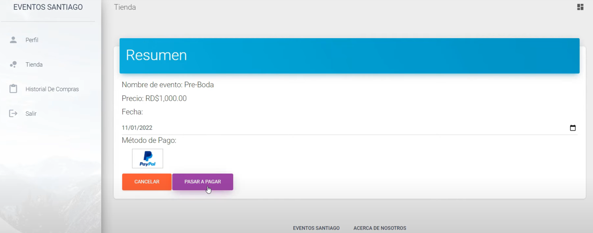

- User's profile

  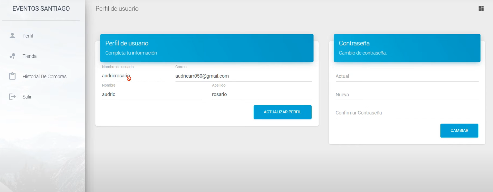

### Admin Views

- Dashboard

  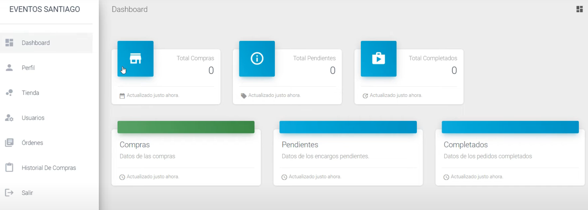

- User CRUD

  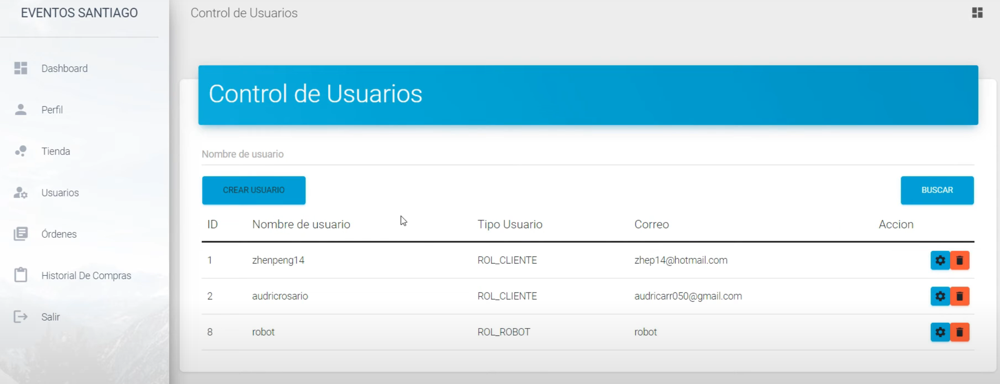

  Update user

  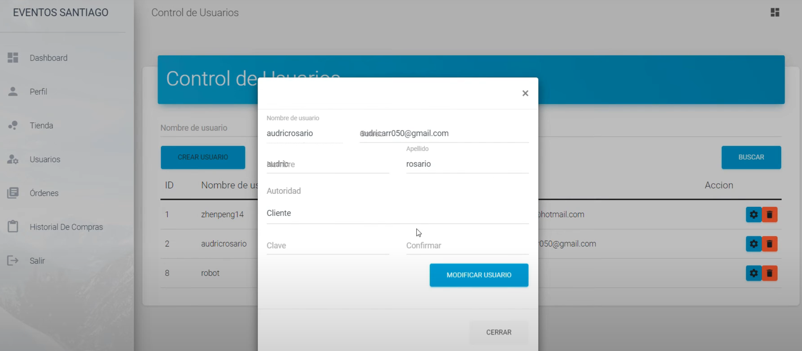

  Change authority

  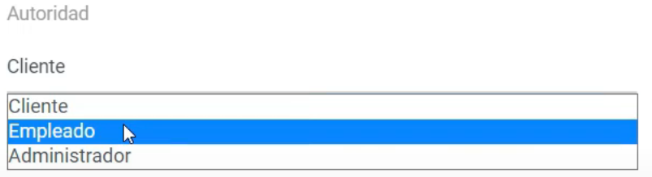

  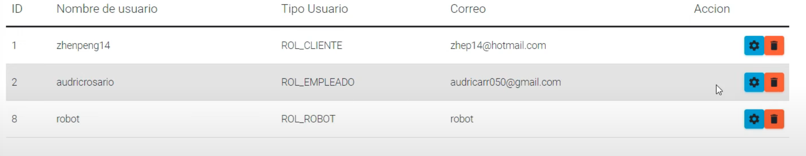

  Delete User

  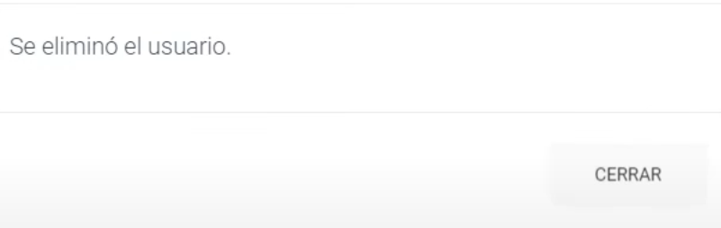

- Purchase Orders

  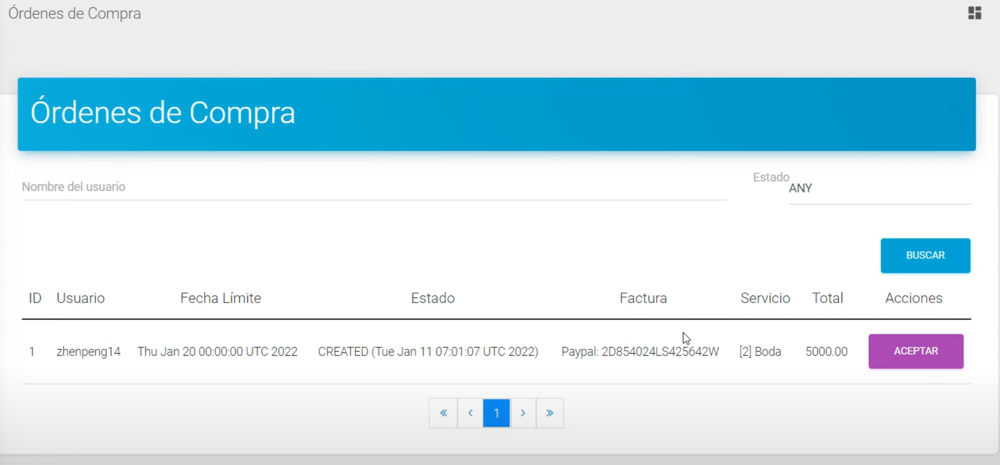

- Sales History

  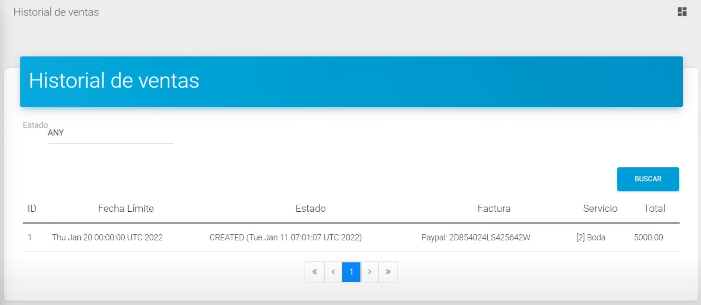

### Microservices

- Set up servers with Docker Compose, from "api-gateway.yml"

  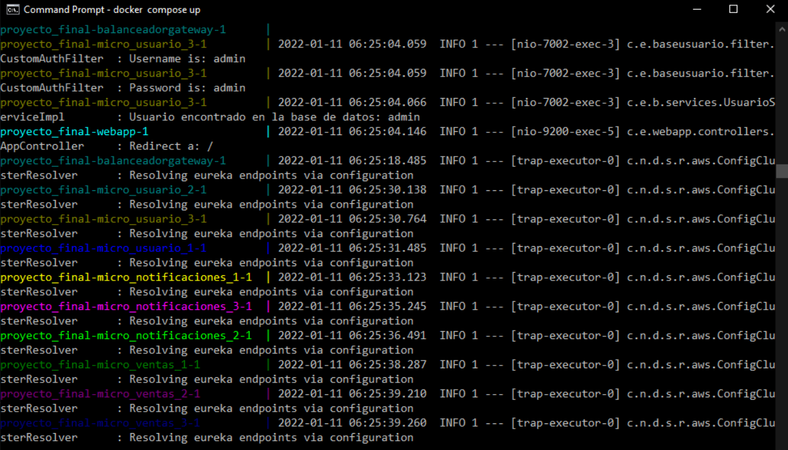

  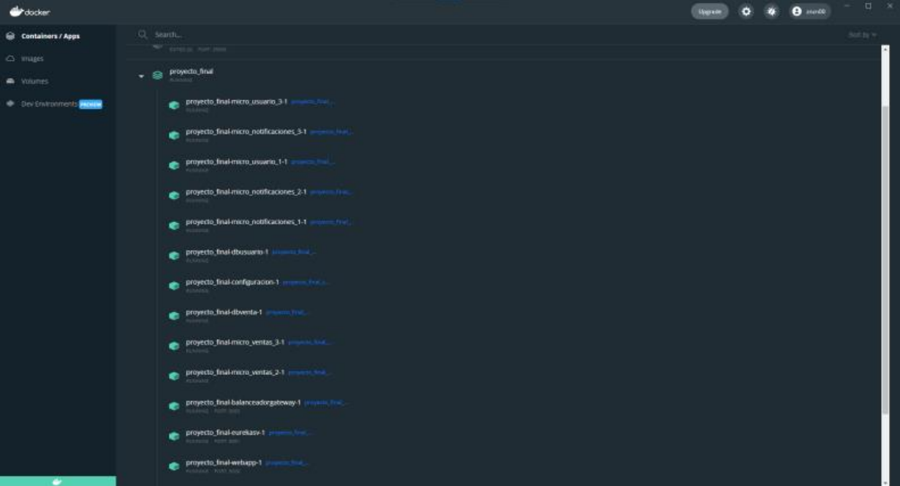
